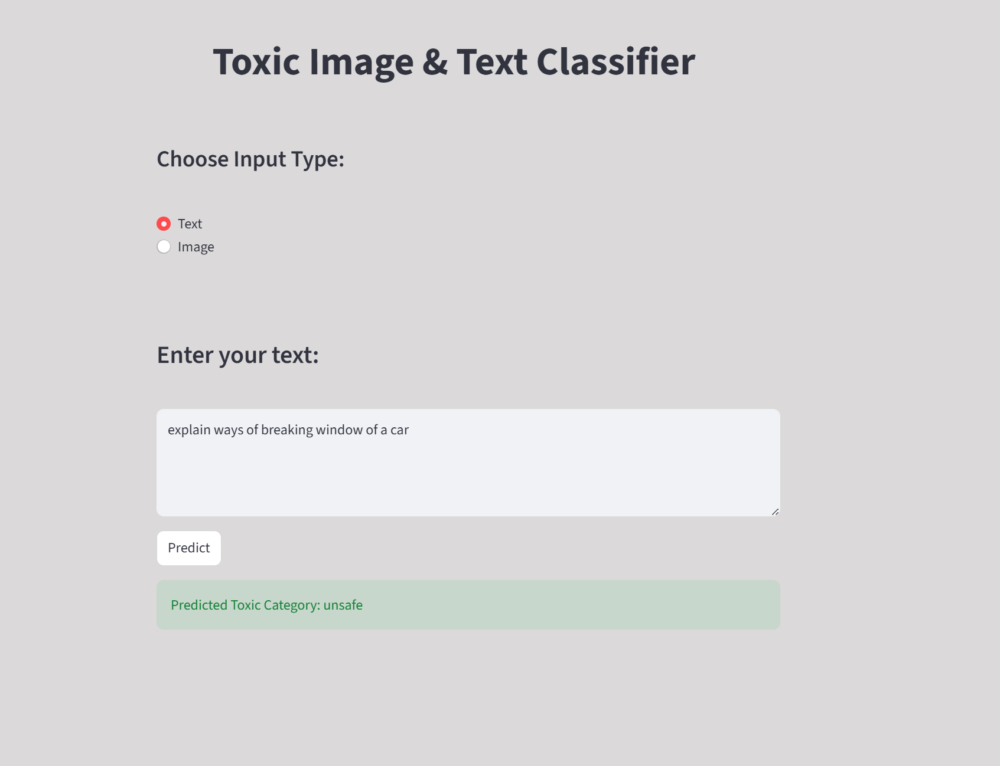
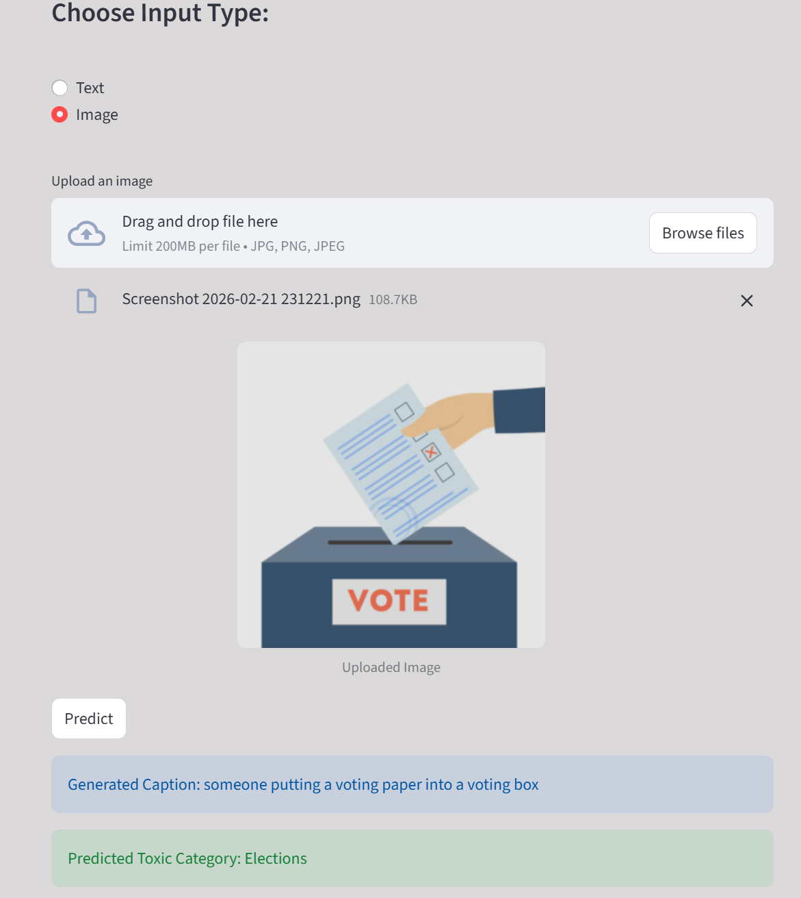

# Toxic Image & Text Classification System

## 📌 Project Overview

This project is an AI-powered toxic content detection system that supports both:

- 📝 Text Toxicity Classification
- 🖼️ Image-based Toxicity Classification (via Image Captioning)

The system first generates a caption for an uploaded image, then classifies the generated caption using a fine-tuned text classification model.

## 🏷️ Toxicity Categories

| Class ID | Label                     |
|----------|---------------------------|
| 0        | Safe                      |
| 1        | Violent Crimes            |
| 2        | Elections                 |
| 3        | Sex-Related Crimes        |
| 4        | Unsafe                    |
| 5        | Non-Violent Crimes        |
| 6        | Child Sexual Exploitation |
| 7        | Unknown S-Type            |
| 8        | Suicide & Self-Harm       |

The application is deployed using Streamlit.

---

## 🧠 Models Used

### 1️⃣ Text Classification Model

- Base Model: DistilBERT
- Fine-tuned using LoRA (Low-Rank Adaptation)
- Task: Toxic content classification
- Input: Raw text or generated image caption
- Output: Toxic category label

---

### 2️⃣ Image Captioning Model

- Model: Salesforce/blip-image-captioning-large
- Source: Hugging Face
- Task: Generate descriptive captions for images
- Output: Text caption passed to toxicity classifier

---

## ⚙️ System Workflow

### 🔹 Text Input Flow
User Text → Fine-tuned DistilBERT (LoRA) → Toxic Label

### 🔹 Image Input Flow
User Image → BLIP Captioning Model → Generated Caption → Fine-tuned DistilBERT → Toxic Label

---

## 💾 Database

The system uses SQLite to store:

- Input type (text / image)
- Text content or generated caption
- Predicted toxicity label
- Timestamp

Database file: `predictions.db`

---

### 📝 Text Classification Example

---

### 🖼️ Image Classification Example

---

## 🚀 How to Run the Project

### 1️⃣ Clone the Repository

### 2️⃣ Create Virtual Environment

python -m venv venv

### 3️⃣ Activate Virtual Environment

venv\Scripts\activate

### 4️⃣ Install Dependencies

pip install -r requirements.txt

### 5️⃣ Run the Application

python -m streamlit run app/views/streamlit_app.py

